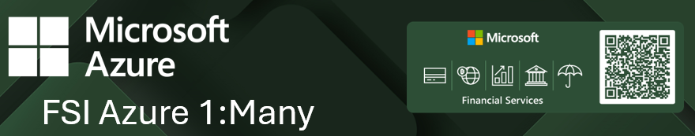
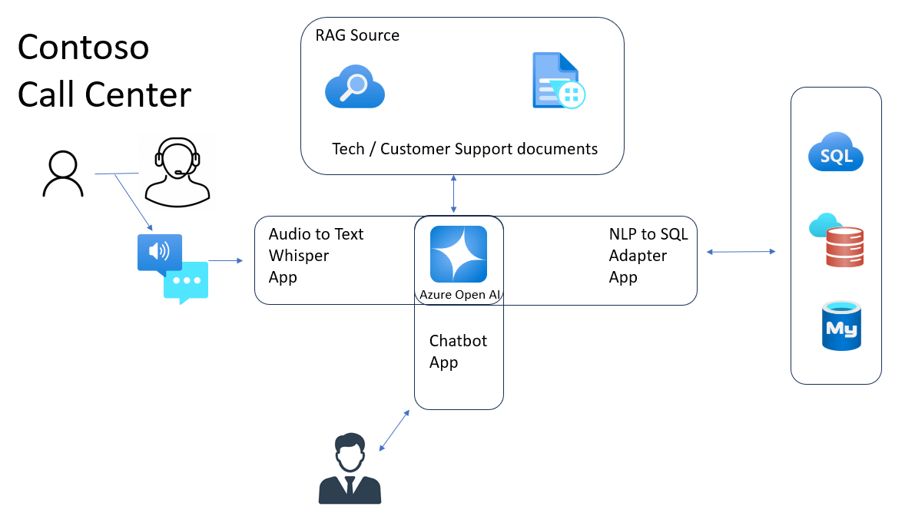
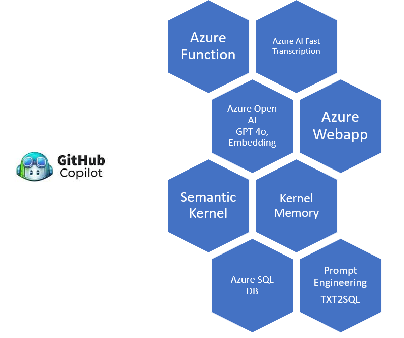
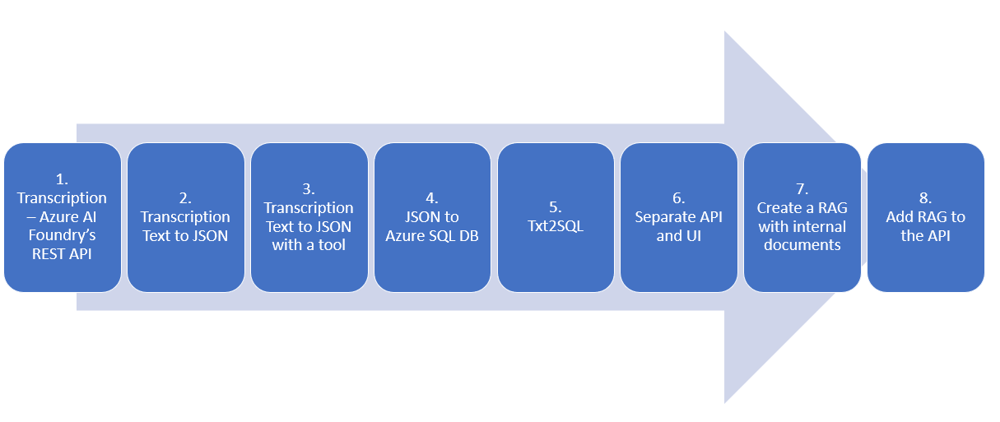

# FSI Call Center - AI-Powered Contact Center PoC


🏦 **A comprehensive Financial Services Industry (FSI) Proof of Concept showcasing Azure AI Foundry, OpenAI, and Semantic Kernel integration for intelligent call center operations**

[](LICENSE)
[](https://azure.microsoft.com/en-us/products/ai-foundry)
[](https://openai.com/)
[](https://github.com/microsoft/semantic-kernel)


## 🌟 Overview

Welcome to the **FSI Special Event's PoC repository** featuring the **Contoso Call Center** stories! This comprehensive suite of applications demonstrates how to leverage cutting-edge Azure AI services to create an end-to-end intelligent call center solution specifically designed for Financial Services Industry requirements.

The solution showcases real-world implementation of:
- **Audio Transcription** using Azure AI Foundry's Whisper model
- **Intelligent Analysis** with Azure OpenAI GPT models and embeddings
- **Text-to-SQL Conversion** for natural language database queries
- **RAG (Retrieval Augmented Generation)** for knowledge-based responses
- **Semantic Kernel Integration** for AI orchestration

## 🏗️ Architecture

### System Architecture Overview


*The comprehensive RAG architecture showing audio processing, intelligent chatbot, NLP-to-SQL conversion, and knowledge base integration*

### Azure Services Stack


*Our Azure ecosystem including Functions, AI Fast Transcription, OpenAI, Web Apps, Semantic Kernel, and SQL Database*

### Implementation Process Flow


*8-step process from transcription through RAG implementation and API integration*

## 📁 Repository Structure

The repository is organized into specialized application components, each focusing on specific aspects of the call center solution:

```
/
├── 🎤 1.RpCCAudioProcessApp/          # Azure Function for audio transcription service
├── 📝 2. RpCCTranscriptAnalyze/        # Text-to-JSON processing with Semantic Kernel
├── 🔧 3. RpCCTranscriptAnalyze.Tools/  # Text-to-JSON processing with Semantic Kernel with tools and native functions
├── 💾 4. RpCCTransferJsonToDb/         # JSON-to-database utilities
├── 💻 5. RpCCAnalyticsConsole/         # Console-based Text-to-SQL application
├── 💬 6. RpCCAnalyticsChat/            # API and UI. UI is built with Streamlit chat interface
├── 🧠 7. RpCCKbRAG/                    # RAG implementation with Kernel Memory
├── 🌐 8. RpContactCenterApi/           # Unified API for Text-to-SQL and RAG

```

## 🚀 Key Components

### 🎤 **RpCCAudioProcessApp** - Audio Transcription Service
Azure Function project that handles audio file transcription using Azure AI Foundry's Fast Transcription service.

**Features:**
- Real-time audio processing
- Integration with Azure AI Foundry Whisper model
- Scalable serverless architecture
- Support for multiple audio formats

### 📝 **RpCCTranscriptAnalyze** - Semantic Analysis Engine
Converts transcribed text to structured JSON using Semantic Kernel implementation.

**Features:**
- Semantic Kernel integration
- Structured data extraction from conversations
- Context-aware text processing
- JSON output for downstream processing

### 🔧 **RpCCTranscriptAnalyze.Tools** - Native Function Toolkit
Supplementary tools providing essential functions like date/time services, highlighting the integration of tools and native functions.

**Features:**
- Date/time utilities
- Custom tool implementations
- Native function examples
- Extensible framework for additional tools

### 💾 **RpCCTransferJsonToDb** - Data Persistence Layer
Utilities for efficiently transferring JSON data to various database systems.

**Features:**
- Multi-database support
- JSON schema validation
- Batch processing capabilities
- Error handling and logging

### 💻 **RpCCAnalyticsConsole** - Text-to-SQL Console
Console application demonstrating Text-to-SQL conversion using Semantic Kernel.

**Features:**
- Natural language query processing
- SQL generation from text
- Console-based interaction
- Semantic Kernel orchestration

### 💬 **RpCCAnalyticsChat** - Interactive Chat Interface
Streamlit-powered chat interface with separate API architecture for user interactions.

**Features:**
- Modern web-based chat UI
- Real-time conversation handling
- Separated API and UI architecture
- Streamlit framework integration

### 🧠 **RpCCKbRAG** - Knowledge Base RAG System
RAG (Retrieval Augmented Generation) application using Semantic Kernel's Kernel Memory for intelligent knowledge retrieval.

**Features:**
- Vector-based document search
- Semantic Kernel Memory integration
- Context-aware response generation
- Knowledge base management

### 🌐 **RpContactCenterApi** - Unified API Gateway
Combined API providing both Text-to-SQL and RAG capabilities in a single, cohesive interface.

**Features:**
- RESTful API endpoints
- Text-to-SQL integration
- RAG source querying
- Unified response handling
- API documentation

## 🛠️ Technology Stack

### **Core Azure Services**
- **Azure AI Foundry** - Whisper model for transcription
- **Azure OpenAI Service** - GPT models and embeddings
- **Azure Functions** - Serverless compute platform
- **Azure SQL Database** - Structured data storage
- **Azure Storage** - File and blob storage

### **AI & ML Frameworks**
- **Semantic Kernel** - AI orchestration and integration
- **Kernel Memory** - Vector storage and retrieval
- **OpenAI GPT Models** - Language understanding and generation
- **Azure Cognitive Services** - Speech and language processing


### **API Keys & Configuration**
```bash
# Required environment variables
AZURE_OPENAI_API_KEY=your_openai_key
AZURE_OPENAI_ENDPOINT=your_openai_endpoint
AZURE_AI_FOUNDRY_KEY=your_foundry_key
AZURE_SPEECH_KEY=your_speech_key
AZURE_SQL_CONNECTION_STRING=your_sql_connection
```

*Built with ❤️ for the Financial Services Industry customers using Azure AI and Semantic Kernel*