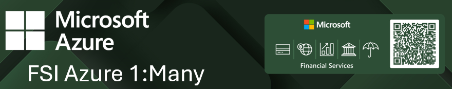

# FSI Call Center

Welcome to the FSI Special Event's PoC repo with the Contoso Call Center stories. This repository contains a suite of small apps designed to highlight and explain how one can utilize Azure AI Foundry's Whisper model, Azure Open AI's GPT models and embedding, Azure Function, Semantic Kernel .. etc to create an end-to-end applications to showcase transcription, prompt engineering, txt2sql, and integration of such.

## Directory Structure

The repository is organized into the following directories:

1. **RpCCAudioProcessApp**: Azure Function project to transcription for the audio file.  It is connecting to Azure AI Foundry's Fast transcription service.
2. **RpCCTranscriptAnalyze**: Transcripted text to JSON, using simple Semantic Kernel implementation.
3. **RpCCTranscriptAnalyze.Tools**: Supplementary tools for supplying today's date.  Highlight the need of supplying a tool and native function.
4. **RpCCTransferJsonToDb**: Utilities for transferring JSON data to databases.
5. **RpCCAnalyticsConsole**: Console application for Txt2SQL with Semantic Kernel.
6. **RpCCAnalyticsChat**: Chat interface using Streamlit and separate to API.
7. **RpCCKbRAG**: RAG application with the Semantic Kernel's Kernel Memory.
8. **RpContactCenterApi**: Combined API for Txt2SQL and RAG sources.

For any questions or support, please let us know.
