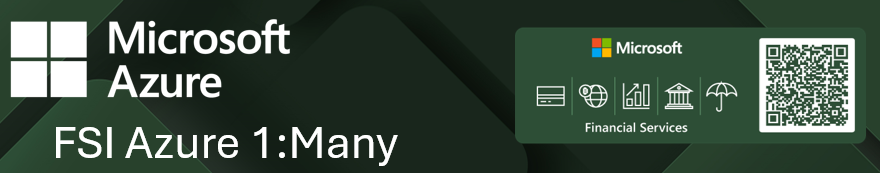
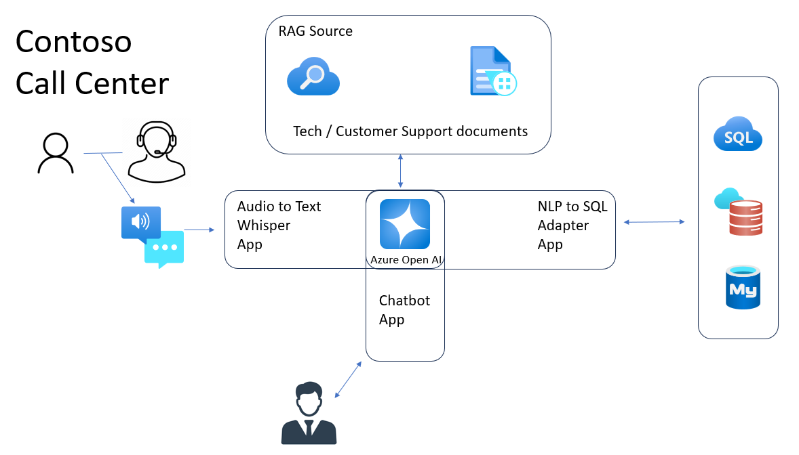
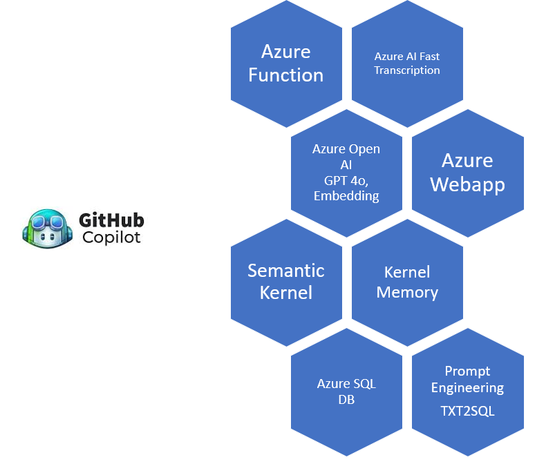
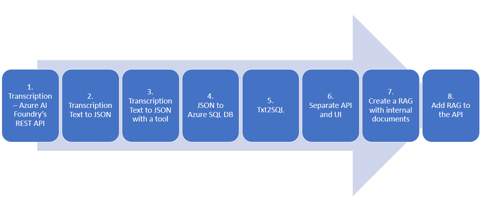

# FSI Call Center - AI-Powered Contact Center PoC


🏦 **A Financial Services Industry (FSI) Proof of Concept showcasing Azure AI Foundry, Azure OpenAI, and the Microsoft Agent Framework on .NET 9 for intelligent call center operations.**

[](LICENSE)
[](https://azure.microsoft.com/en-us/products/ai-foundry)
[](https://learn.microsoft.com/azure/ai-services/openai/)
[](https://learn.microsoft.com/agent-framework/)
[](https://dotnet.microsoft.com/)


## 🌟 Overview

Welcome to the **FSI Special Event PoC repository** featuring the **Contoso Call Center** stories. This suite of applications demonstrates an end-to-end intelligent call center pipeline built on **Azure AI Foundry / Azure OpenAI**, **.NET 9**, and the **Microsoft Agent Framework (MAF)**.

> **Migration status (branch `maf.1.0`):** the projects in this repo were originally built on **Semantic Kernel + Kernel Memory**. They are being progressively rewritten to use the **Microsoft Agent Framework 1.10** with **MAF Agents**, **MAF Workflows**, and the **DevUI** — running on **.NET 9**. Projects #1 – #7 have been migrated; #8 is next.

The solution covers:
- **Audio transcription** using Azure AI Foundry Fast Transcription (Whisper)
- **Conversation analytics** with Azure OpenAI GPT-4o (text → structured JSON)
- **Native function tooling** via MAF tools (date/time, lookups)
- **Persistence** of structured analytics into Azure SQL / SQL Server
- **Natural-language → SQL** conversational analytics with MAF agents
- **DevUI-hosted chat** over the analytics + knowledge base
- **Vector RAG** over PDF knowledge bases using `text-embedding-3-large`

## 🏗️ Architecture

### System Architecture Overview


*The end-to-end flow: audio capture → transcription → analytics → structured persistence → natural-language analytics & knowledge-base RAG, surfaced through a unified API.*

### Azure Services Stack


*Azure ecosystem: Functions, Fast Transcription, Azure OpenAI, App Service, SQL Database, plus the Microsoft Agent Framework runtime and DevUI.*

### Implementation Process Flow


*8-step process from transcription through MAF-based analytics, RAG, and a unified API.*

## 📁 Repository Structure

```
/
├── 🎤 1. RpCCAudioProcessApp/         # Azure Function — audio → transcript (Fast Transcription)
├── 📝 2. RpCCTranscriptAnalyze/       # MAF agent — transcript → structured JSON
├── 🔧 3. RpCCTranscriptAnalyze.Tools/ # MAF agent + native function tools (date/time, etc.)
├── 💾 4. RpCCTransferJsonToDb/        # JSON → SQL Server persistence
├── 💻 5. RpCCAnalyticsConsole/        # Console NL → SQL with a MAF agent
├── 💬 6. RpCCAnalyticsChat/           # MAF agent + DevUI for analytics chat
├── 🧠 7. RpCCKbRAG/                   # MAF Workflow RAG (ContosoKB) over PDFs + DevUI
└── 🌐 8. RpContactCenterApi/          # Unified API for analytics + RAG  (TBD)
```

## 🚀 Key Components

### 🎤 **1. RpCCAudioProcessApp** — Audio Transcription Service
Azure Functions project that accepts audio and produces a transcript via **Azure AI Foundry Fast Transcription**.

- Serverless audio ingestion
- Whisper-based transcription
- Outputs raw transcript text for downstream analysis

### 📝 **2. RpCCTranscriptAnalyze** — Conversation Analytics Agent
Converts a raw transcript into structured JSON (caller intent, sentiment, entities, action items) using a **Microsoft Agent Framework** agent on Azure OpenAI.

- MAF `AIAgent` over Azure OpenAI GPT-4o
- Strongly-typed structured output
- Drop-in replacement for the previous Semantic Kernel implementation

### 🔧 **3. RpCCTranscriptAnalyze.Tools** — Native Function Tooling
Demonstrates **MAF tools / native functions** — letting the agent call .NET methods (e.g. current date/time, lookups) during analysis.

- `[Description]`-annotated tool methods
- Tool invocation orchestrated by MAF
- Pattern for extending the analytics agent with custom capabilities

### 💾 **4. RpCCTransferJsonToDb** — Data Persistence
Loads the structured JSON produced by project #2 into **SQL Server** (`Call_Center` database).

- Schema-validated inserts
- Batch-friendly
- Targets a local SQL Server instance by default

### 💻 **5. RpCCAnalyticsConsole** — NL → SQL (Console)
Console app where a **MAF agent** translates natural-language questions into SQL against the `Call_Center` database, runs the query, and returns results.

- Schema-aware prompt
- Safe read-only execution
- Console interface for quick analytics

### 💬 **6. RpCCAnalyticsChat** — DevUI Analytics Chat
The same NL → SQL agent as #5, but exposed through the **MAF DevUI** as a browser chat experience.

- ASP.NET Core host with `AddDevUI()` / `AddOpenAIResponses()`
- OpenAI-compatible `/v1/responses` endpoint
- DevUI at `http://localhost:8888/devui`

### 🧠 **7. RpCCKbRAG** — ContosoKB Knowledge-Base RAG
**MAF Workflow** that performs vector RAG over the Contoso Tech-Support Guidelines and Employee Handbook PDFs.

- Simplest RAG topology: `UserQuery → VectorSearch → Answer`
- PDFs auto-indexed at startup with `text-embedding-3-large`
- Inline `[Source — page N]` citations
- Single agent named **`ContosoKB`** in DevUI

### 🌐 **8. RpContactCenterApi** — Unified API *(planned)*
A single API surface composing the analytics agent and the ContosoKB RAG workflow into one set of endpoints for upstream callers (web, mobile, IVR).

## 🛠️ Technology Stack

### Core Azure Services
- **Azure AI Foundry** — Fast Transcription (Whisper)
- **Azure OpenAI Service** — `gpt-4o`, `text-embedding-3-large`
- **Azure Functions** — serverless transcription endpoint
- **SQL Server / Azure SQL Database** — structured analytics storage

### AI & Application Frameworks
- **Microsoft Agent Framework 1.10** — `AIAgent`, `Workflow`, `Executor<T>`
- **MAF DevUI** — browser chat host with OpenAI-compatible Responses API
- **MAF Hosting / Hosting.OpenAI** — DI integration for ASP.NET Core
- **Microsoft.Extensions.AI** — `IChatClient` abstractions
- **.NET 9** — the runtime for every C# project in this repo
- **UglyToad.PdfPig** — PDF text extraction for the RAG indexer

### Configuration

Each project has its own `appsettings.json` template with a git-ignored `appsettings.Local.json` for credentials. Typical keys:

```json
{
  "AzureAI": {
    "Endpoint": "https://YOUR_RESOURCE.cognitiveservices.azure.com/",
    "ApiKey": "...",
    "ChatModel": "gpt-4o",
    "EmbeddingModel": "text-embedding-3-large"
  }
}
```

For project #4 / #5 / #6 a SQL Server connection string targeting the `Call_Center` database is also required.

---

*Built with ❤️ for Financial Services Industry customers using Azure AI and the Microsoft Agent Framework.*